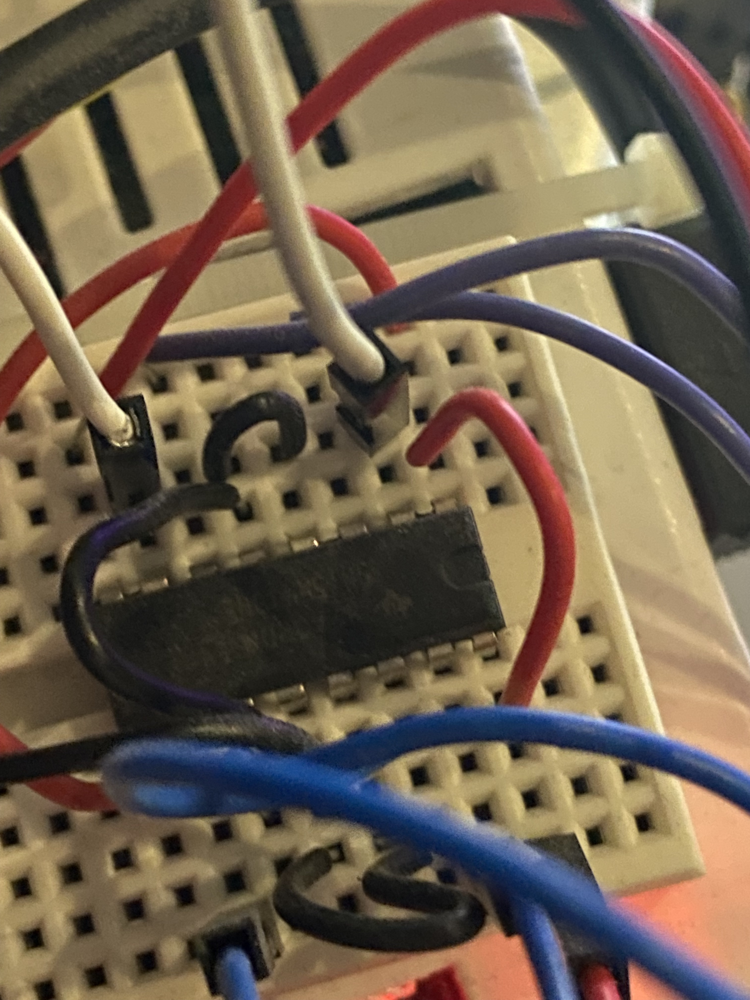
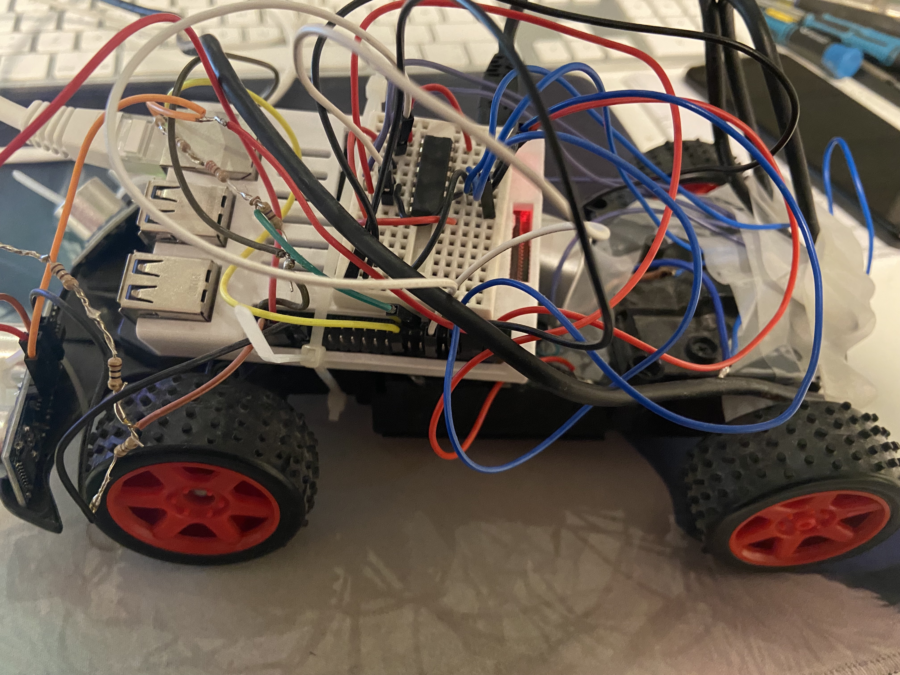
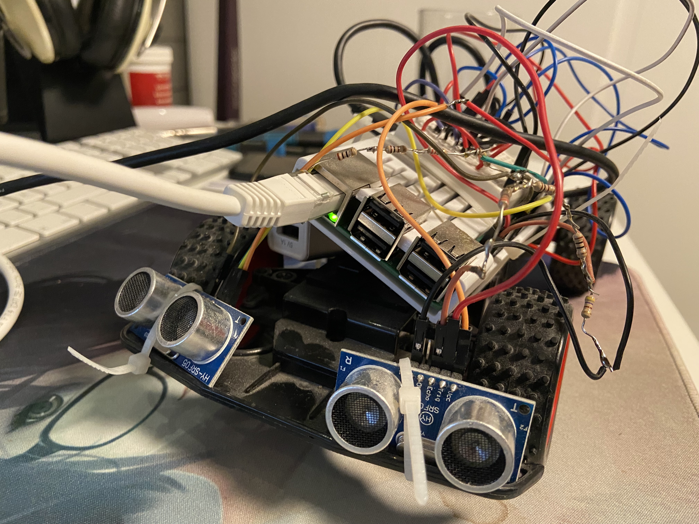
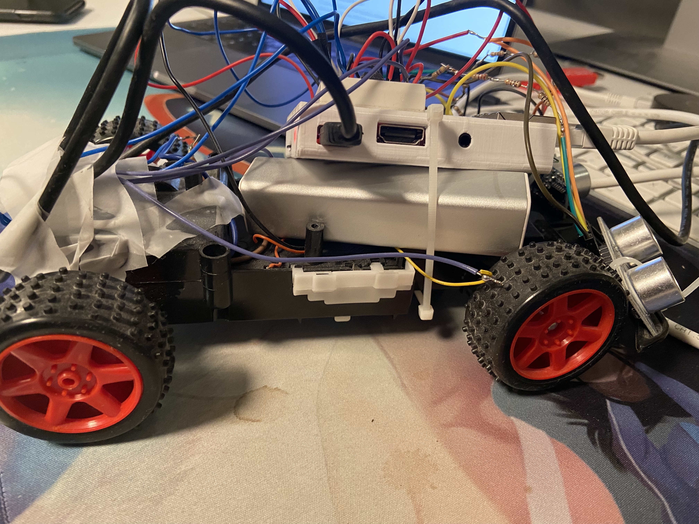

# self-driving-car

## Overview
I used a standard cheap rc car for this project. To control the car I used an raspberry Pi with distance sensors connected to Pi´s IO pins. To power the standard battery pack is used, to power the Pi an external battery pack with usb is used.

## Images of the build process
Here are some images illustrating the build process and wire connections on the car and connection board.

